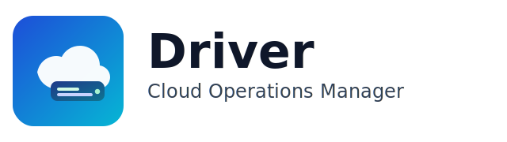
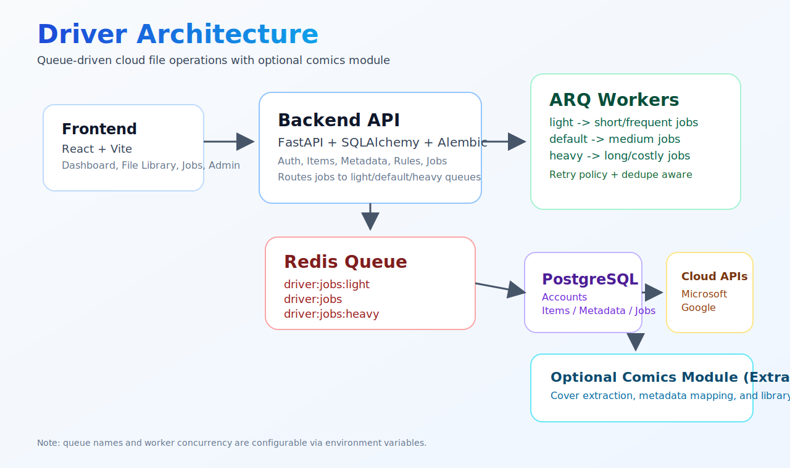
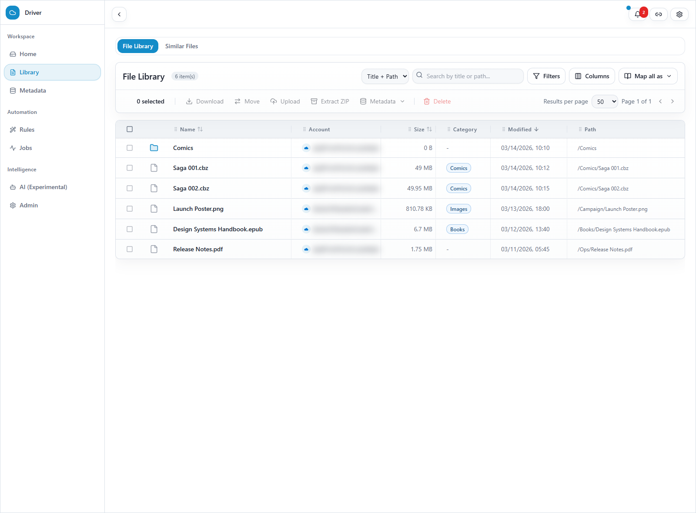
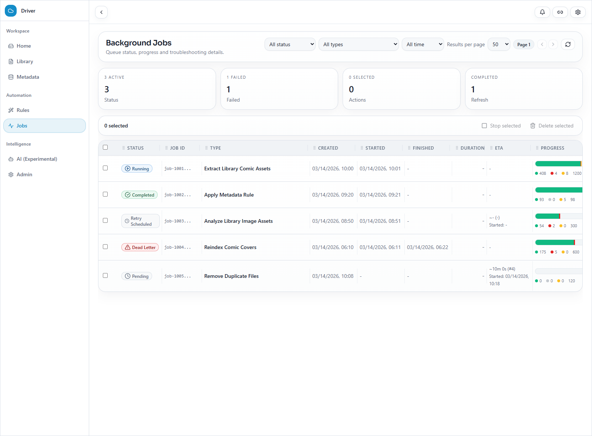
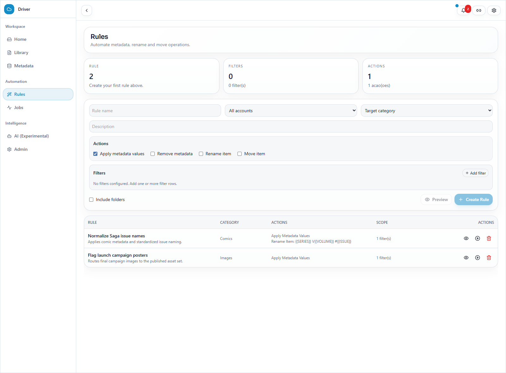
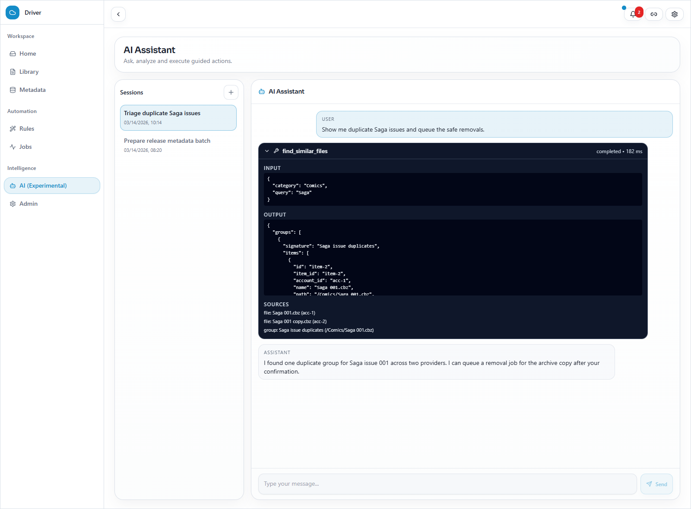
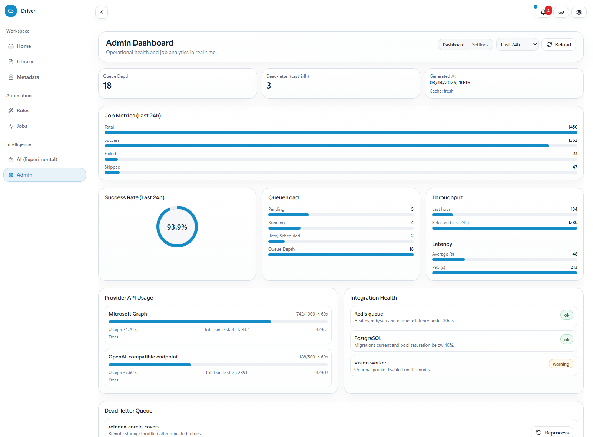
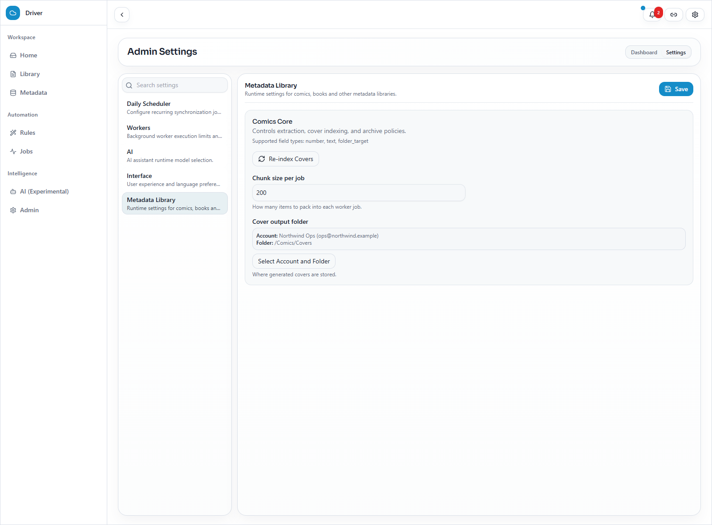

<p align="center">
  
</p>

# Driver


Driver is an open-source cloud operations manager for teams that need one place to browse storage, enrich metadata, automate repetitive workflows, and observe background jobs without losing operational context.

It connects Microsoft OneDrive, Google Drive, and Dropbox behind a single workspace with FastAPI, React, Redis, and Docker Compose.

> Warning: this app is intentionally vibe coded. If the vibes are good, ship it. If the vibes are cursed, check the logs first.

## Table of Contents

1. [Why Driver](#why-driver)
2. [Highlights](#highlights)
3. [Architecture](#architecture)
4. [Screenshots](#screenshots)
5. [Stack](#stack)
6. [Quick Start](#quick-start)
7. [Configuration](#configuration)
8. [Workers and Queues](#workers-and-queues)
9. [Metadata Libraries](#metadata-libraries)
10. [Documentation](#documentation)
11. [Useful Commands](#useful-commands)
12. [Troubleshooting](#troubleshooting)

## Why Driver

- Unify multi-provider file operations in one UI instead of juggling vendor consoles.
- Turn metadata into a first-class workflow with bulk edits, rules, and library-specific schemas.
- Run expensive operations asynchronously with queues, retries, dead-letter handling, and job visibility.
- Give operators a real control plane with dashboards, runtime settings, and AI-assisted actions.

## Highlights

- Unified file workspace with search, filters, bulk actions, uploads, and similar-file reports.
- Metadata libraries for comics, images, and books, with category stats, layouts, and inline editing.
- Rules engine to apply metadata, remove metadata, rename items, and move items at scale.
- AI assistant with tool traces, confirmation gates, and workspace-aware actions.
- Admin dashboard for queue depth, success rate, provider usage, throughput, latency, and dead-letter analysis.
- Admin settings for scheduler, worker runtime, AI provider mode, language, and plugin-backed metadata libraries.
- Docker Compose topology with shared backend runtime image, migration service, and a single general-purpose worker.

## Architecture



High-level flow:

- React + Vite frontend for operator workflows.
- FastAPI API for provider integration, metadata, rules, admin, and AI routes.
- Redis-backed ARQ workers for async jobs and retries.
- PostgreSQL-compatible database for application state.
- Image-analysis jobs can be toggled independently and are disabled by default in the sample environment.

## Screenshots

All screenshots below were regenerated from mocked workspace data and include privacy-safe masking for identity fields.

<table>
  <tr>
    <td width="50%">
      
      <br />
      <strong>All Files Workspace</strong>
      <br />
      Cross-account browsing with filters, metadata context, bulk actions, and library-aware mapping.
    </td>
    <td width="50%">
      
      <br />
      <strong>Background Jobs</strong>
      <br />
      Queue state, retries, ETA signals, and per-job progress in one operational view.
    </td>
  </tr>
  <tr>
    <td width="50%">
      
      <br />
      <strong>Rules Engine</strong>
      <br />
      Automate metadata, rename, and move workflows with reusable rules.
    </td>
    <td width="50%">
      
      <br />
      <strong>AI Assistant</strong>
      <br />
      Guided actions with tool traces, readable inputs and outputs, and operator oversight.
    </td>
  </tr>
  <tr>
    <td width="50%">
      
      <br />
      <strong>Admin Dashboard</strong>
      <br />
      Operational analytics for queue depth, provider usage, success rate, and dead-letter trends.
    </td>
    <td width="50%">
      
      <br />
      <strong>Admin Settings</strong>
      <br />
      Tune scheduler, workers, AI runtime, and metadata-library plugins from the UI.
    </td>
  </tr>
</table>

## Stack

- Backend: FastAPI + SQLAlchemy + Alembic
- Workers: ARQ + Redis
- Frontend: React + Vite + Tailwind
- Database: PostgreSQL (recommended)
- Optional extras: AI runtime integrations and a dedicated vision worker profile

## Quick Start

Prerequisites:

- Python 3.12+
- Node.js 18+
- `uv`
- Docker Desktop for Compose-based execution

### Docker Compose (recommended)

```bash
docker compose up -d --build --remove-orphans
```

Default behavior:

- builds the shared backend runtime image once and reuses it for API + worker
- runs database migrations in the `migrate` service before API/workers start
- uses local Docker tags for dev compose and leaves release versioning to CI/CD

Services:

- Frontend: `http://localhost:5173`
- Backend API: `http://localhost:8000`
- OpenAPI: `http://localhost:8000/docs`
- Redis: `localhost:6379`
- Worker: `worker`

Logs:

```bash
docker compose logs -f backend
docker compose logs -f migrate
docker compose logs -f worker
```

Stop:

```bash
docker compose down
```

### Local development

Install dependencies once:

```bash
uv sync --project src/backend
npm.cmd --prefix src/frontend ci --workspaces=false
```

Run backend + frontend in one terminal:

```bash
uv run scripts/dev.py
```

By default this launcher starts:

- backend API
- Vite frontend
- `worker`

Redis still needs to be running separately.

Useful flags:

```bash
uv run scripts/dev.py --skip-migrate
uv run scripts/dev.py --skip-workers
uv run scripts/dev.py --with-scheduler
uv run scripts/dev.py --backend-port 8001 --frontend-port 5174
uv run scripts/dev.py --dry-run
```

Manual backend (PowerShell, from repo root):

```powershell
uv sync --project src/backend
$env:PYTHONPATH = (Resolve-Path .\src)
uv run --project src/backend alembic -c src/alembic.ini upgrade head
uv run --project src/backend uvicorn backend.main:app --reload --host 0.0.0.0 --port 8000
```

Manual frontend:

```bash
npm.cmd --prefix src/frontend ci --workspaces=false
npm.cmd --prefix src/frontend run dev --workspaces=false
```

Workers via Docker Compose:

```bash
docker compose up -d worker
docker compose logs -f worker
docker compose stop worker
```

Dedicated scheduler process:

```bash
uv run python -m backend.workers.scheduler_worker
```

## Configuration

1. Copy `env.example` to `.env`.
2. Fill in OAuth credentials and secrets.
3. Set `DATABASE_URL` and `REDIS_URL`.

### Required core settings

- `SECRET_KEY`
- `ENCRYPTION_KEY`
- `DATABASE_URL`
- `REDIS_URL`

### Required provider settings

Microsoft provider:

- `MS_CLIENT_ID`
- `MS_CLIENT_SECRET`
- `MS_REDIRECT_URI`

Google provider:

- `GOOGLE_CLIENT_ID`
- `GOOGLE_CLIENT_SECRET`
- `GOOGLE_REDIRECT_URI`

Dropbox provider:

- `DROPBOX_CLIENT_ID`
- `DROPBOX_CLIENT_SECRET`
- `DROPBOX_REDIRECT_URI`

You can run with only Microsoft, only Google, or only Dropbox.

### Useful optional settings

- `MS_TENANT_ID` defaults to `common`
- `REDIS_QUEUE_NAME` defaults to `driver:jobs`
- `WORKER_CONCURRENCY`
- `WORKER_JOB_TIMEOUT_SECONDS`
- `DB_POOL_MODE`
- `DB_POOL_SIZE`
- `DB_MAX_OVERFLOW`
- `ENABLE_DAILY_SYNC_SCHEDULER`
- `RUN_SCHEDULER_IN_API`
- `SCHEDULER_DISTRIBUTED_LOCK_ENABLED`
- `SCHEDULER_LOCK_KEY`
- `SCHEDULER_LOCK_TTL_SECONDS`
- `DAILY_SYNC_CRON`
- comics and metadata-library vars under `COMIC_*` when you enable those workflows
- AI runtime settings and remote provider vars for the assistant features

### Official provider documentation

- Microsoft Entra app registration:
  `https://learn.microsoft.com/entra/identity-platform/quickstart-register-app`
- Microsoft Graph permissions reference:
  `https://learn.microsoft.com/graph/permissions-reference`
- Google OAuth consent screen:
  `https://developers.google.com/workspace/guides/configure-oauth-consent`
- Google OAuth 2.0 for web server apps:
  `https://developers.google.com/identity/protocols/oauth2/web-server`
- Dropbox OAuth guide:
  `https://developers.dropbox.com/oauth-guide`
- Dropbox app console:
  `https://www.dropbox.com/developers/apps`

## Workers and Queues

Current strategy:

- one shared queue backed by one worker service with higher concurrency
- sync, metadata, rules, IO, and comics jobs all resolve to `driver:jobs`
- image-analysis jobs are intentionally disabled while the vision path is being reworked

Current Compose profile:

- `worker`: `WORKER_CONCURRENCY=6`, `DB_POOL_MODE=null`
- backend API: `DB_POOL_MODE=null`

Container and build notes:

- backend and worker share the same `driver-backend:local` image
- the backend Docker build ignores `src/frontend` entirely to cut build context size
- the frontend image is tagged as `driver-frontend:local`
- the frontend image copies only the files required for the Vite production build

For managed poolers such as Supabase Session mode, prefer `DB_POOL_MODE=null` so each process does not stack its own large SQLAlchemy pool on top of the external pooler.

## Metadata Libraries

Driver ships with library-oriented workflows instead of treating every file the same way.

- `comics_core`: archive extraction, issue-centric metadata, cover indexing, and library jobs
- `images_core`: image analysis, image tagging, and media-oriented enrichment
- `books_core`: book metadata mapping and library-scale indexing

You can keep using Driver as a general cloud operations tool, or lean into the library features as your catalog grows.

## Documentation

- [API docs index](docs/README.md)
- [Complete backend endpoint map](docs/endpoints.md)
- OpenAPI UI at `http://localhost:8000/docs`

## Useful Commands

Backend:

```bash
uv run pytest -q
uv run --project src/backend pytest --cov=src/backend --cov-report=xml
```

Frontend:

```bash
cd src/frontend
npm.cmd run lint --workspaces=false
npm.cmd run build --workspaces=false
npm.cmd run test --workspaces=false
npm.cmd run coverage --workspaces=false
```

Full coverage check:

```bash
uv run python scripts/run_coverage.py
```

Important endpoints:

- Health: `http://localhost:8000/health`
- OpenAPI: `http://localhost:8000/docs`
- Admin settings API: `GET/PUT /api/v1/admin/settings`
- Admin observability API: `GET /api/v1/admin/observability`

## Troubleshooting

### `npx.ps1` blocked in PowerShell

Use `npx.cmd` and `npm.cmd`:

```powershell
npx.cmd --version
npm.cmd run dev --workspaces=false
```

### Old worker containers after Compose changes

```bash
docker compose up -d --build --remove-orphans
```

### Worker is not processing jobs

Checklist:

- Redis is running: `docker compose logs -f redis`
- the worker has the correct `WORKER_QUEUE_NAME`
- the backend queue policy resolves jobs to `driver:jobs`
- migrations completed successfully in the `migrate` service
