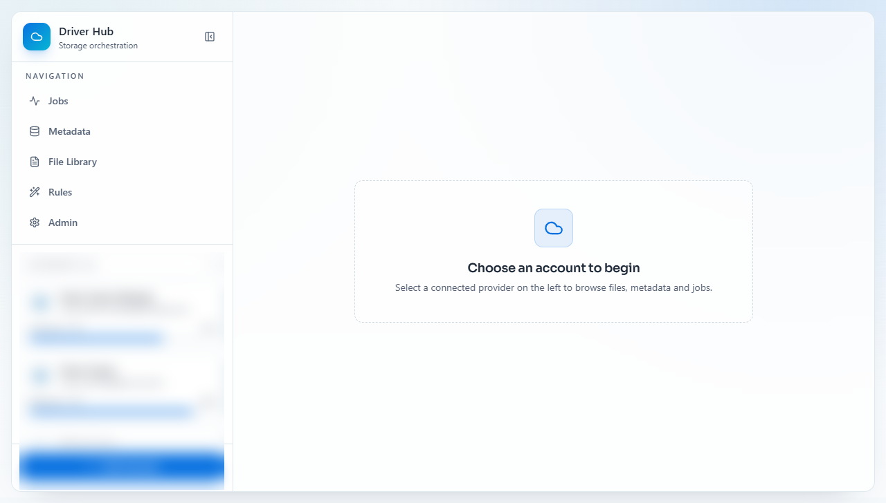
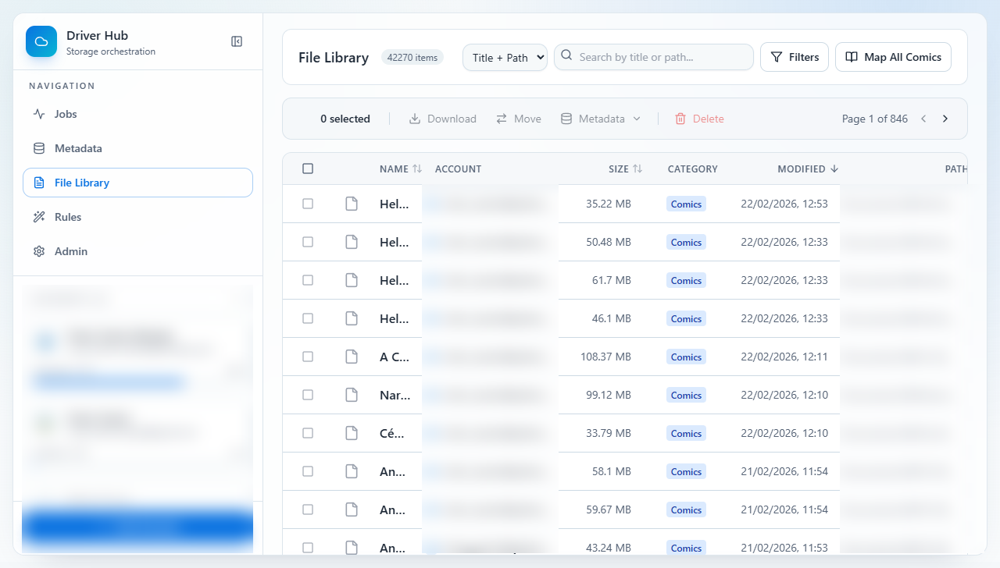
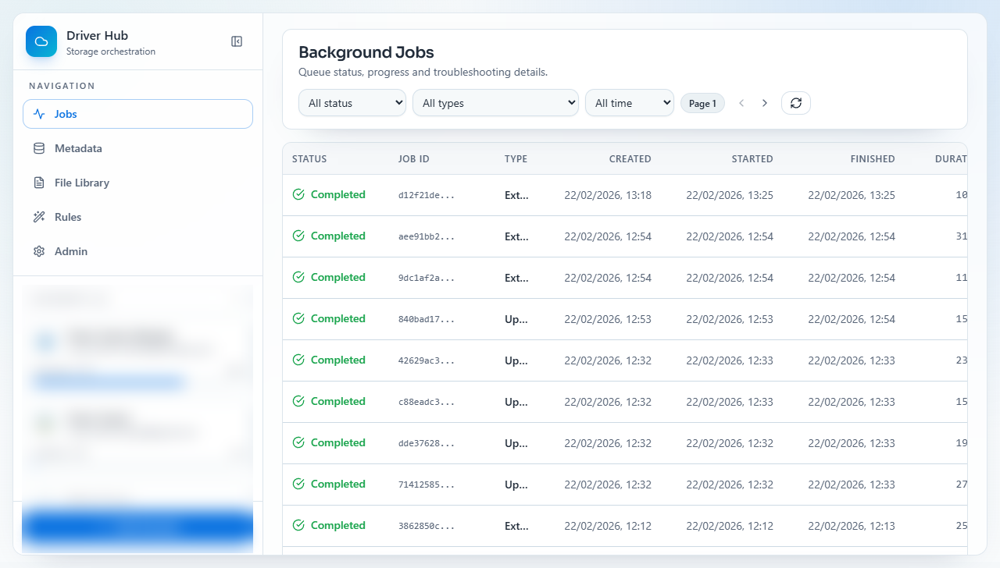
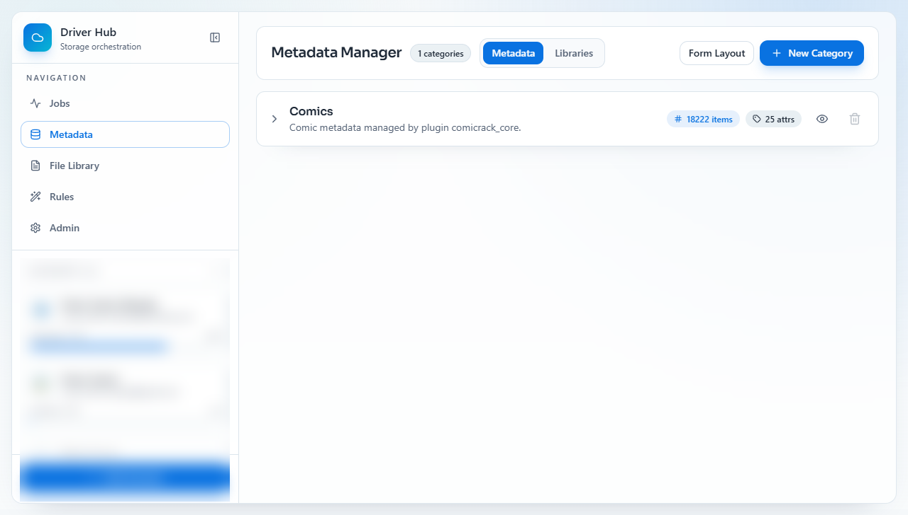
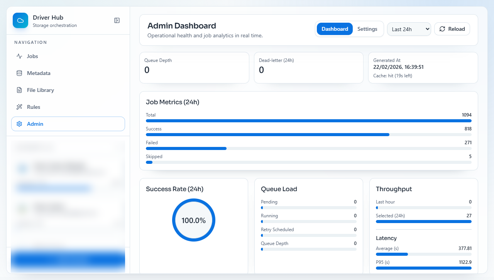

<p align="center">
  
</p>

# Driver - Cloud Operations Manager


A full-stack application to connect cloud storage providers, browse file libraries, and run asynchronous operations (sync, upload, metadata, rules) with operational observability.

> Warning: this app is intentionally vibe coded. If the vibes are good, ship it. If the vibes are cursed, check the logs first.

## Table of Contents

1. [Overview](#overview)
2. [Architecture](#architecture)
3. [Screenshots](#screenshots)
4. [Stack](#stack)
5. [Prerequisites](#prerequisites)
6. [Configuration](#configuration)
7. [Running with Docker](#running-with-docker-recommended)
8. [Running locally](#running-locally)
9. [Queues and workers](#queues-and-workers-light-default-heavy)
10. [Optional Comics Module (Extra)](#optional-comics-module-extra)
11. [Useful commands](#useful-commands)
12. [Troubleshooting](#troubleshooting)

## Overview

With Driver, you can:

- connect multiple cloud accounts (Microsoft and Google)
- browse and search files in one place
- apply metadata in bulk, recursively, and via rules
- monitor jobs and attempts with retry/dead-letter flows
- track operational health in the Admin dashboard
- optionally enable comics-focused workflows as an extra module

## Architecture


## Screenshots

### Home


### File Library


### Jobs


### Metadata


### Admin Dashboard


## Stack

- Backend: FastAPI + SQLAlchemy + Alembic
- Workers: ARQ + Redis
- Frontend: React + Vite + Tailwind
- Database: PostgreSQL (recommended)

## Prerequisites

- Python 3.12+
- Node.js 18+
- `uv`
- Docker Desktop (optional, for Compose-based execution)

## Configuration

1. Copy `env.example` to `.env`.
2. Fill in OAuth credentials and secrets.
3. Set `DATABASE_URL` (PostgreSQL recommended).

### Required (core)

- `SECRET_KEY`
- `ENCRYPTION_KEY`
- `DATABASE_URL`
- `REDIS_URL`

### Required (at least one provider)

Microsoft provider:
- `MS_CLIENT_ID`
- `MS_CLIENT_SECRET`
- `MS_REDIRECT_URI`

Google provider:
- `GOOGLE_CLIENT_ID`
- `GOOGLE_CLIENT_SECRET`
- `GOOGLE_REDIRECT_URI`

You can run with only Microsoft or only Google. You do not need both.

### Optional (recommended defaults exist)

- `MS_TENANT_ID` (defaults to `common`)
- `REDIS_QUEUE_NAME` (defaults to `driver:jobs`)
- `WORKER_CONCURRENCY`
- `WORKER_JOB_TIMEOUT_SECONDS`
- `JOB_TYPE_QUEUE_MAP` (routes job types to queues)
- `ENABLE_DAILY_SYNC_SCHEDULER`
- `DAILY_SYNC_CRON`
- comics-related vars (`COMIC_*`) if you enable the optional comics module

### Official provider documentation

- Microsoft Entra app registration:
  `https://learn.microsoft.com/entra/identity-platform/quickstart-register-app`
- Microsoft Graph permissions reference:
  `https://learn.microsoft.com/graph/permissions-reference`
- Google OAuth consent screen:
  `https://developers.google.com/workspace/guides/configure-oauth-consent`
- Google OAuth 2.0 for web server apps:
  `https://developers.google.com/identity/protocols/oauth2/web-server`

## Running with Docker (recommended)

```bash
docker compose up -d --build --remove-orphans
```

Services:

- Frontend: `http://localhost:5173`
- Backend API: `http://localhost:8000`
- OpenAPI: `http://localhost:8000/docs`
- Redis: `localhost:6379`
- Workers: `worker-light`, `worker-default`, `worker-heavy`

Logs:

```bash
docker compose logs -f backend
docker compose logs -f worker-light
docker compose logs -f worker-default
docker compose logs -f worker-heavy
```

Stop:

```bash
docker compose down
```

## Running locally

### Backend

```bash
uv sync
uv run alembic upgrade head
uv run uvicorn backend.main:app --reload --host 0.0.0.0 --port 8000
```

### Frontend

```bash
cd frontend
npm.cmd ci --workspaces=false
npm.cmd run dev --workspaces=false
```

### Workers (local, PowerShell)

```powershell
powershell -ExecutionPolicy Bypass -File scripts/start-workers.ps1 -Action start
powershell -ExecutionPolicy Bypass -File scripts/start-workers.ps1 -Action status
powershell -ExecutionPolicy Bypass -File scripts/start-workers.ps1 -Action stop
```

Files generated by the script:

- logs: `logs/workers/*.log`
- pids: `.run/workers/*.pid`

By default, workers start with hidden windows (background mode). For visual debugging:

```powershell
powershell -ExecutionPolicy Bypass -File scripts/start-workers.ps1 -Action start -ShowWindows
```

## Queues and workers (light/default/heavy)

Current strategy:

- `light`: short/frequent jobs (higher concurrency)
- `default`: medium jobs
- `heavy`: heavy/long jobs (lower concurrency)

Current Compose profile:

- `worker-light`: `WORKER_CONCURRENCY=8`, `DB_POOL_SIZE=3`
- `worker-default`: `WORKER_CONCURRENCY=3`, `DB_POOL_SIZE=2`
- `worker-heavy`: `WORKER_CONCURRENCY=1`, `DB_POOL_SIZE=1`
- backend API: `DB_POOL_SIZE=6`

This helps keep fast jobs responsive while preventing heavy jobs from monopolizing resources.

## Optional Comics Module (Extra)

The comics feature set is an optional extra. You can use this project purely as a cloud file operations manager.

When enabled, comics workflows can act as a manager for:

- cover extraction
- metadata mapping for comic files
- library-level comic processing jobs

If you do not need it, keep comics queue concurrency low or disable comics-oriented routes/jobs in your deployment policy.

## Useful commands

### Backend

```bash
uv run pytest -q
```

### Frontend

```bash
cd frontend
npm.cmd run lint --workspaces=false
npm.cmd run build --workspaces=false
```

### Important endpoints

- Health: `http://localhost:8000/health`
- OpenAPI: `http://localhost:8000/docs`
- Admin settings API: `GET/PUT /api/v1/admin/settings`

## Troubleshooting

### 1) `npx.ps1` blocked in PowerShell

Use `npx.cmd`/`npm.cmd`:

```powershell
npm.cmd run dev --workspaces=false
```

### 2) Old worker containers

When changing services in compose, use:

```bash
docker compose up -d --build --remove-orphans
```

### 3) Worker is not processing jobs

Checklist:

- Redis is running (`docker compose logs -f redis`)
- worker has the correct `WORKER_QUEUE_NAME`
- backend routes `JOB_TYPE_QUEUE_MAP` to queues with active workers
